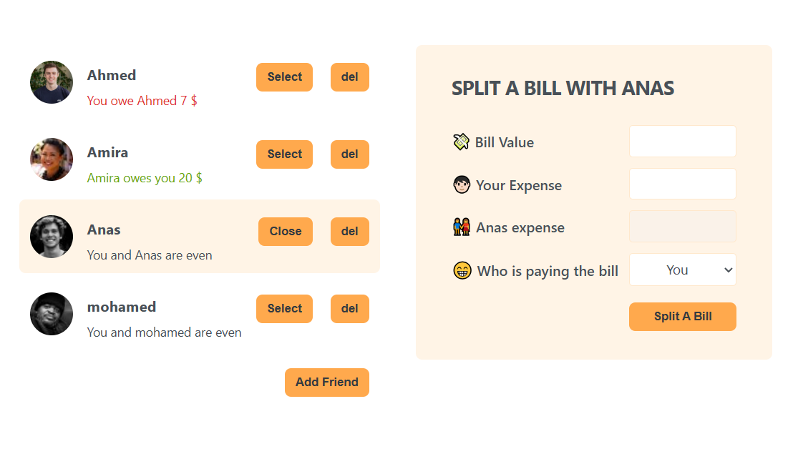

# Friend List and Bill Splitting App

## Description

Friend List and Bill Splitting App is a React-based application designed to manage friendships and split bills easily. The app allows users to add friends, select and delete friends, and handle bill splitting between friends with clear balance tracking. This project utilizes React hooks for state management and a component-based architecture to ensure a clean and modular design.

## Features

- **Add Friends**: Add new friends with a unique name and profile image.
- **Select Friends**: Choose a friend to split a bill with.
- **Delete Friends**: Remove friends from the list.
- **Split Bills**: Input bill amounts and calculate how much each person owes or is owed.
- **Balance Tracking**: Track balances to see who owes whom and how much.

## Technologies Used

- React: For building the user interface.
- CSS: For styling the components.
- JavaScript: For functionality and logic.
- [Pravatar](https://i.pravatar.cc/): For generating random user avatars.

## Installation

1. Clone the repository:
   ```sh
   git clone https://github.com/Ahmed-K-Fouda/eat-n-split
   ```
2. Navigate to the project directory:
   ```sh
   cd friend-list-bill-splitting-app
   ```
3. Install dependencies:
   ```sh
   npm install
   ```
4. Start the development server:
   ```sh
   npm start
   ```

## Usage

- Open the application in your browser.
- Use the sidebar to add, select, and delete friends.
- Select a friend to split a bill with and input the bill details.
- The application will calculate and display the balance between you and your friend.

## Contributing

Contributions are welcome! Please open an issue or submit a pull request.

## License

This project is licensed under the MIT License.

## Screenshots



## Contact

Created by [Ahmed.Fouda](https://github.com/Ahmed-K-Fouda) - feel free to contact me!
